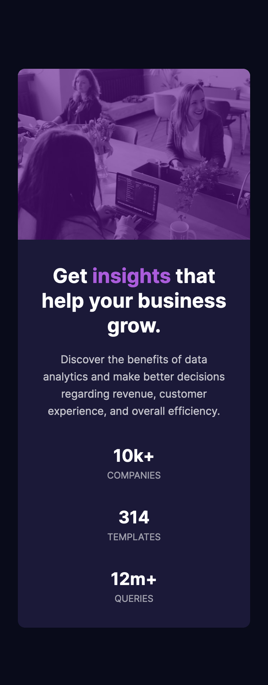

# Frontend Mentor - Stats preview card component solution

This is a solution to the [Stats preview card component challenge on Frontend Mentor](https://www.frontendmentor.io/challenges/stats-preview-card-component-8JqbgoU62). Frontend Mentor challenges help you improve your coding skills by building realistic projects. 

## Table of contents

- [Overview](#overview)
  - [The challenge](#the-challenge)
  - [Screenshot](#screenshot)
  - [Links](#links)
- [My process](#my-process)
  - [Built with](#built-with)
  - [What I learned](#what-i-learned)
  - [Continued development](#continued-development)
- [Author](#author)

## Overview

### The challenge

Users should be able to:

- View the optimal layout depending on their device's screen size

### Screenshot

### Links

- Solution URL: [Github](https://github.com/erelita/stats_previewcard.git)
- Live Site URL: [Netlify](https://stats-previewcard-byer.netlify.app/)

## My process

### Built with

- Semantic HTML5 markup
- CSS custom properties
- Flexbox
- CSS Grid

### What I learned

I'm getting familiar with CSS grid and a little bit of flexbox. I was also able to apply a color with opacity over the header image. 

### Continued development

Making responsive website is still hard for me. I made this based on the widths given, i.e. 375px and 1440px. I hope I can improve on this in the future.

## Author

- Github - [Erelita](https://github.com/erelita)
- Frontend Mentor - [@erelita](https://www.frontendmentor.io/profile/erelita)

